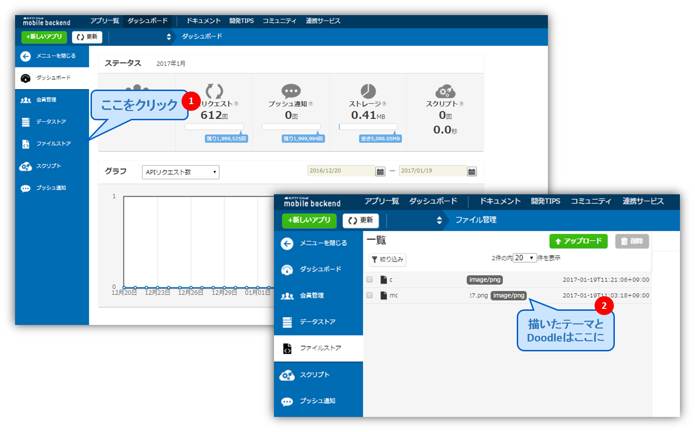
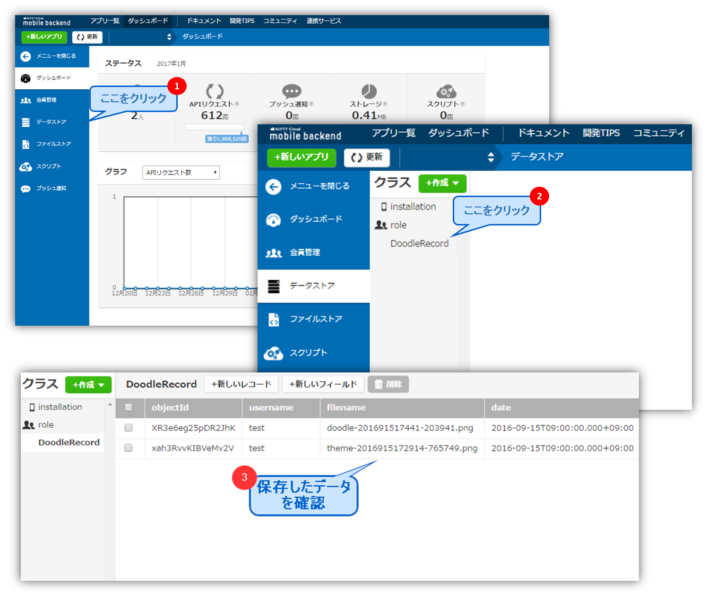

# 【Unity】想像力を目覚めさせる軽いゲームを作ろう！

## 概要
* [ニフティクラウドmobile backend](http://mb.cloud.nifty.com/)の『ファイルストア機能』、『会員管理機能』、『データストア機能』を利用してUnityのサンプルプゲームプロジェクトです
* 簡単な操作ですぐに [ニフティクラウドmobile backend](http://mb.cloud.nifty.com/)の機能を体験いただけます★★

## ニフティクラウドmobile backendって何？？
スマートフォンアプリのバックエンド機能（プッシュ通知・データストア・会員管理・ファイルストア・SNS連携・位置情報検索・スクリプト）が**開発不要**、しかも基本**無料**(注1)で使えるクラウドサービス！今回はデータストアを体験します

注1：詳しくは[こちら](http://mb.cloud.nifty.com/price.htm)をご覧ください

## 動作環境
* windows7以上、或いはOS X
* Unity5.3.5以上

※上記内容で動作確認をしています。

## 手順
###『STEP 1』準備＆アプリ起動
### 1. [ニフティクラウドmobile backend](http://mb.cloud.nifty.com/)の会員登録とログイン→アプリ作成

* 上記リンクから会員登録（無料）をします。登録ができたらログインをすると下図のように「アプリの新規作成」画面が出るのでアプリを作成します

* アプリ作成されると下図のような画面になります
* この２種類のAPIキー（アプリケーションキーとクライアントキー）は次のステップで使用します。 

### 2. GitHubからサンプルプロジェクトの<a href="https://github.com/ellentby/Doodle-DrawTogether/archive/master.zip">ダウンロード</a>

* 上記のリンクをクリックして、プロジェクトをダウンロード下さい。

### 3. Unityでアプリを起動

* ダウンロードしたフォルダを解凍し、Unityから開いてください。その後、loginシーンを開いてください。

### 4. APIキーの設定

* loginシーンの`NCMBSettings`を編集します
* 先程[ニフティクラウドmobile backend](http://mb.cloud.nifty.com/)のダッシュボード上で確認したAPIキーを貼り付けます

* 貼り付けたらシーンを保存して下さい。

### 5. アプリ再生
* Unity画面で上部真ん中の実行ボタン（さんかくの再生マーク）をクリックしして、ゲームを体験しましょう！

 
###『STEP 2』ゲームの動作確認
###①　アカウント登録
* 自分が好きなニックネームとパスワードを入力し、「Sign Up」ボタンをクリックして下さい。（2回目以降は`your name`と`your password`を入力してLog Inボタンをタップします）

 * 次の画面が出てきたら、登録成功です。

---------
* ダッシュボードで動作確認しましょう！
  1. ニフティクラウドmobile backendの<a href="https://console.mb.cloud.nifty.com">ダッシュボード</a>で、左の「会員管理」をクリックして下さい。
  2. 先ほど作成したアカウントを確認しましょう。

###②　テーマとDoodleの保存
* 「New Theme」ボタンをクリックし、簡単な絵を描きましょう。ここで描いた絵は、テーマとして、Doodle（落書き）の基礎になります。
* 描き終わったら、「submit」ボタンをクリックして保存して下さい。

* テーマを保存したら、Doodleを描きましょう！
 1. メイン画面の「Today's Theme」ボタンをクリックして、次の画面で、先に描いたテーマを選択して下さい。
 2. 「Draw my doodle」をクリックし、先に描いたテーマを基にして、Doodleを描きましょう！
 3. 描き終わったら、「Submit」ボタンをクリックして保存して下さい。

* 保存したDoodleは、次の画面で確認できます。 

--------

* 描いたテーマとDoodlleを<a href="https://console.mb.cloud.nifty.com">ダッシュボード</a>で確認しましょう！
  1. ダッシュボードの左にある「ファイルストア」をクリックして下さい。
  2. 保存したテーマとDoodleのファイルは画面の右で確認できます。
  

-----

* ファイルストアには、画像ファイルのみが保存されます。絵の作者やタイプ（Doodleかテーマか）などの情報を一緒に管理するにはデータストアを利用します。
  - このアプリでは「DoodleRecord」というクラスをデータストアに作成し管理しています。
* データストアも確認しましょう！
  1. <a href="https://console.mb.cloud.nifty.com">ダッシュボード</a>で、左側の「データストア」をクリックし、「DoodleRecord」というクラスをクリックして下さい。
  2. 右の画面で、先に保存しましたなテーマとDoodleのレコードを確認できます。

##機能解説
ユーザー登録と画像データの保存、絵を描く、ランキング機能などの具体的な解説は<a href="https://github.com/ellentby/Doodle-DrawTogether/blob/master/%E6%A9%9F%E8%83%BD%E8%A7%A3%E8%AA%AC.md">機能解説ドキュメント</a>をご参照下さい：

<ul>
  <li><a href="機能解説.md#q1">『機能一』ユーザー登録とログイン（会員管理）</a>
  ★☆☆☆☆</li>
  <li><a href="機能解説.md#q2">『機能二』落書き機能</a>
  ★★★★☆</li>
  <li><a href="機能解説.md#q3">『機能三』画像の保存と取得（ファイルストア）</a>
  ★★☆☆☆</li>
  <li><a href="機能解説.md#q4">『機能四』画像に関するデータの保存と取得（データストア）</a>
  ★☆☆☆☆</li>
  <li><a href="機能解説.md#q5">『機能五』人気ランキング機能（データストア）</a>
  ★★★☆☆</li>
</ul>

## 参考
* ニフティクラウドmobile backend の[ドキュメント（会員管理）](http://mb.cloud.nifty.com/doc/current/user/basic_usage_unity.html)
* ニフティクラウドmobile backend の[ドキュメント（ファイルストア）](http://mb.cloud.nifty.com/doc/current/filestore/basic_usage_unity.html)
* ニフティクラウドmobile backend の[ドキュメント（データストア）](http://mb.cloud.nifty.com/doc/current/datastore/basic_usage_unity.html)
* このアプリの[機能解説ドキュメント](https://github.com/ellentby/Doodle-DrawTogether/blob/master/%E6%A9%9F%E8%83%BD%E8%A7%A3%E8%AA%AC.md)
