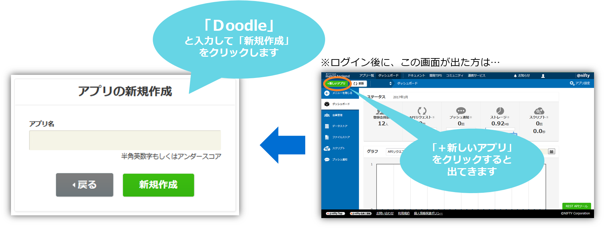

# 【Unity】想像力を目覚める軽いゲームを作りましょ！

## 概要
* [ニフティクラウドmobile backend](http://mb.cloud.nifty.com/)の『ファイルストア機能』、『会員管理機能』、『データストア機能』を利用してUnityのサンプルプゲームプロジェクトです
* 簡単な操作ですぐに [ニフティクラウドmobile backend](http://mb.cloud.nifty.com/)の機能を体験いただけます★☆

## ニフティクラウドmobile backendって何？？
スマートフォンアプリのバックエンド機能（プッシュ通知・データストア・会員管理・ファイルストア・SNS連携・位置情報検索・スクリプト）が**開発不要**、しかも基本**無料**(注1)で使えるクラウドサービス！今回はデータストアを体験します

注1：詳しくは[こちら](http://mb.cloud.nifty.com/price.htm)をご覧ください

## 動作環境
* windows7以上、或いはOS X
* Unity5.3.5以上

※上記内容で動作確認をしています。

## 手順
###『STEP 1』アカウント登録　⇒　アプリ再生
### 1. [ニフティクラウドmobile backend](http://mb.cloud.nifty.com/)の会員登録とログイン→アプリ作成

* 上記リンクから会員登録（無料）をします。登録ができたらログインをすると下図のように「アプリの新規作成」画面が出るのでアプリを作成します

* アプリ作成されると下図のような画面になります
* この２種類のAPIキー（アプリケーションキーとクライアントキー）はXcodeで作成するiOSアプリに[ニフティクラウドmobile backend](http://mb.cloud.nifty.com/)を紐付けるために使用します

* 動作確認後に会員情報が保存される場所も確認しておきましょう

### 2. [GitHub](https://github.com/hounenhounen/UnityLoginApp)からサンプルプロジェクトの<a href="https://github.com/ellentby/Doodle-DrawTogether/archive/master.zip">ダウンロード</a>

### 3. Unityでアプリを起動

* ダウンロードしたフォルダを解凍し、Unityから開いてください。その後、loginシーンを開いてください。

### 4. APIキーの設定

* loginシーンの`NCMBSettings`を編集します
* 先程[ニフティクラウドmobile backend](http://mb.cloud.nifty.com/)のダッシュボード上で確認したAPIキーを貼り付けます

* それぞれ`YOUR_NCMB_APPLICATION_KEY`と`YOUR_NCMB_CLIENT_KEY`の部分を書き換えます
 * このとき、ダブルクォーテーション（`"`）を消さないように注意してください！
* 書き換え終わったら、シーンを保存して下さい。

### 5. アプリ再生
* Unity画面で上部真ん中の実行ボタン（さんかくの再生マーク）をクリックしして、ゲームを体験しましょ！

 
###『STEP 2』ゲーム体験　＆　動作確認
###体験①　アカウント登録
* 自分が好きなニックネームとパスワードを輸入し、「Sign Up」ボタンをクリックして下さい。（2回目以降は`your name`と`your password`を２つ入力してLog Inボタンをタップします）

 * 次の画面が出てきたら、登録成功になります。

---------
* ダッシュボードで動作確認しましょ！
  1. ニフティクラウドmobile backendの<a href="https://console.mb.cloud.nifty.com">ダッシュボード</a>で、左の「会員管理」をクリックして下さい。
  2. 先作成したアカウントを確認しましょ。

###体験②　画像保存
* 「new theme」ボタンをクリックし、簡単な画像を描きましょ。この画像は、テーマとして、Doodle（落書き）の基礎になります。
* 描き終わったら、「submit」ボタンをクリックして下さい。

* テーマをセーブしたら、今回はDoodleを描きましょ」！
* 主画面に「Today's Theme」ボタンをクリックして、次の画面に、先に描いたテーマを選択して下さい。
* 「Draw my doodle」をクリックし、先に描いたテーマを基にして、Doodleを描きましょ！
* 描きおわったら、「Submit」ボタンをクリックして下さい。

* Doodleをセーブして、すぐに次の画面で確認できます。 

## 参考
* ニフティクラウドmobile backend の[ドキュメント（会員管理）](http://mb.cloud.nifty.com/doc/current/user/basic_usage_unity.html)
