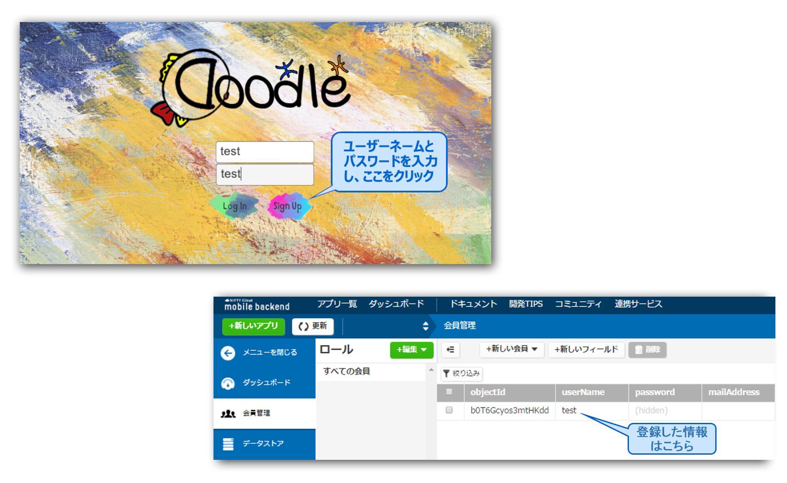

<h1>Doodle機能解説</h1>
<h5>このドキュメントは、「Doodle」の核となるの５つの機能の具体的な技術解説です。</h5>
ニフクラmobile backendの紹介や、ゲームを遊ぶための作業の手順は、<a href="README.md">README</a>をご覧ください。

<h2 id="keyquestion">機能リスト</h2>
<ul>
  <li><a href="#q1">『機能一』ユーザー登録とログイン（会員管理）</a>
  難易度/★☆☆☆☆</li>
  <li><a href="#q2">『機能二』Doodle(落書き)機能</a>
  難易度/★★★★☆</li>
  <li><a href="#q3">『機能三』画像の保存と取得（ファイルストア）</a>
  難易度/★★☆☆☆</li>
  <li><a href="#q4">『機能四』画像に関するデータの保存と取得（データストア）</a>
  難易度/★☆☆☆☆</li>
  <li><a href="#q5">『機能五』人気ランキング機能（データストア）</a>
  難易度/★★★☆☆</li>
</ul>
以下の流れで、機能を一つずつ解説します。
 <ul>
 		 <li><b>機能説明</b> 
  		実装した機能に対応するmBaaSの機能（「会員管理」、「データストア」、「ファイルストア」）や、アプリ機能を説明します。</li>
		  <li><b>主な手順</b> 
		  機能を作成する手順や、主な実装コードとそれに関するUnityの操作を紹介します。
		  </li>
		  <li><b>動作確認</b> 
		  操作の結果をダッシュボードで確認します。
		  </li>
		  <li><b>Tips</b> 
		  mBaaSに関して注意すべきこと、Unityの便利な機能など、Tipsとして紹介します。
		  </li>
		  <li><b>Discussion</b> 
		  このドキュメントは、アプリの全機能の説明はせず、代表的な機能のみ説明しています。説明できなかった機能は「Discussion」として実装コードを紹介しているので、そちらをご覧ください。
	  	　 コードを探す方法は<a href="#discussionanswer">こちら</a>。
		  </li>
</ul>

<h2 id="q1">『機能一』　ユーザー登録とログイン（会員管理）</h2>
<h5>難易度/★☆☆☆☆</h5>
<ul>
  <li><b>機能説明</b> 
  	<ul>
	<li>mBaaSについて 
  	この機能を開発するには、mBaaSの「会員管理」機能を利用します。主な機能はユーザー登録、ログイン、ログアウトです。ここではユーザー登録機能についてのみ解説します。ログインとログアウト機能については、「Discussion」として考えてみましょう。
	</li>
	<li>アプリ機能について 
	ゲームを開始時には必ず、ユーザー登録（或いはログイン）が必要です。一方、ゲームを終了する際は、終了ボタンを押すことで、自動的にログアウトができます。 
  
  	</li>
	</ul>
  </li>
  <li><b>主な手順</b> 
  　この部分で使用されるシーンとGameobject： 
   <pre>シーン「login」
  <b>「Name」</b>（Inputfield）
  <b>「Password」</b>（Inputfield）
  <b>「Login」</b>（Button）
  <b>「SignUp」</b>（Button）
  「Controller」Component<b>「ButtonController」</b>（Script）
  </pre>
  
1. ユーザーネームとパスワードを入力するためのInputfield Gameobjectの「Name」と「Password」を生成します。（<a href="https://raw.githubusercontent.com/ellentby/Doodle-DrawTogether/master/readme-img/01login.gif">動画を見る</a>） 
  2. 「Log In」、「Sign Up」のボタンを生成します。（<a href="https://raw.githubusercontent.com/ellentby/Doodle-DrawTogether/master/readme-img/02loginbuttons.gif">動画を見る</a>） 
  3. シーンで「Controller」というEmpty Gameobjectと「ButtonController.cs」というスクリプトを生成して、「Controller」にドラッグ＆ドロップで追加します。（<a href="https://raw.githubusercontent.com/ellentby/Doodle-DrawTogether/master/readme-img/03ButtonController.gif">動画を見る</a>）
  

  登録ボタンを押下時の処理は以下のように記述します：
  <pre data-lang="c#">
	public InputField nameInput;
	public InputField passwordInput;
	public void OnSignUp(){
		//NCMBUserのインスタンス作成 
		NCMBUser user = new NCMBUser();
		//ユーザ名とパスワードの設定
		user.UserName = nameInput.text;
		user.Password = passwordInput.text;
				
		//会員登録を行う
		user.SignUpAsync((NCMBException e) => { 
			if (e != null) {
				UnityEngine.Debug.Log ("新規登録に失敗: " + e.ErrorMessage);
			} else {
				UnityEngine.Debug.Log ("新規登録に成功");
				//新しいシーンをロード
				Application.LoadLevel("title");
			}
		});
	}
  </pre>
  4. Unityに戻り、「Sign Up」ボタンをクリックします。インスペクター内にあるOnClick関数の所に、「＋」マークをクリックします。
　

  5. 「Controller」を下にドラッグし、OnSignUp()関数を選択します。（<a href="https://raw.githubusercontent.com/ellentby/Doodle-DrawTogether/master/readme-img/04SignUpClick.gif">4.と5.の動画を見る</a>）
  

   6. 「Controller」をクリックして、ユーザーネームとパスワードの入力ボックスを「Name Input」と「Password Input」にドラッグ＆ドロップします。（<a href="https://raw.githubusercontent.com/ellentby/Doodle-DrawTogether/master/readme-img/05DragInputField.gif">動画を見る</a>）
  

  </li>
  <li><b>動作確認</b> 
  	<ul>
		<li>アプリを実行し、ユーザー登録をしてmBaaSのダッシュボードを確認します。登録したユーザー情報を確認できます。 
			
		</li>
	</ul>
  </li>
  <li><b>Tips</b>
   - ユーザーネームとパスワード両方の入力が必要なため、チェックを行う関数が必要です。
   - SignUpAsync()関数は、非同期処理の関数です。非同期処理は、次のステップを実行しながら通信をバックグランドで行う処理です。
　 - Unityにはドラッブ＆ドロップでclickeventを処理する関数を指定する便利な機能があります。
（<a href="https://raw.githubusercontent.com/ellentby/Doodle-DrawTogether/master/readme-img/04SignUpClick.gif">サンプル動画</a>）  
</li>
  <li><b>Discussion</b>
   ログインとログアウトの機能を実装しましょう ┃難易度★☆☆☆☆
   <アンサーは<a href="#a1">こちら</a>>
  </li>
</ul>
<a href="#keyquestion">リストに戻る</a>
<h2 id="q2">『機能二』　Doodle(落書き)機能</h2>
<h5>難易度/★★★★☆</h5>
<ul>
  <li><b>機能説明</b> 
	この機能を開発するには、UnityEngineの「LineRenderer」というComponentを利用します。「LineRender」の関数「SetPosition()」と「SetPositions()」を利用し、線の頂点を設置することで、絵を描くことが可能になります。 
	ただし、一つのLineRenderは一本の線しか描けません。また、一つのGameobjectは、一つのLineRendererだけに対応します。したがって、複数の線で絵を描くには、複数のGameobjectを生成しなければいけません。 
	※「LineRenderer」に関しては、Unityの<a href="http://docs.unity3d.com/jp/current/ScriptReference/LineRenderer.html">ドキュメント</a>をご参照下さい。
  </li>
  <li><b>主な手順</b> 
この部分で使用されるシーンとGameobject：
<pre>シーン「draw」
	「Line0」Component<b>「LineRenderer」</b>、<b>「DrawLine」</b>(Script)
</pre>
　1. 「DrawLine.cs」というスクリプトを生成します。 
　2. 「DrawLine.cs」で、「defaultRenderer」というLineRendererを定義し、初期化します。
  <pre>
   defaultRenderer = gameObject.GetComponent();
   defaultRenderer.material = new Material (shader);
   defaultRenderer.SetVertexCount (0);
   defaultRenderer.SetWidth (0.1f, 0.1f);
   defaultRenderer.SetColors (Color.green, Color.green);
   defaultRenderer.useWorldSpace = true;
  </pre>
　3. シーンで、「Line0」というGameobjectを生成し、「Add　Component」の所で「LineRenderer」を生成します。「DrawLine.cs」を「Line0」にドラッグ＆ドロップで追加します。（<a href="https://raw.githubusercontent.com/ellentby/Doodle-DrawTogether/master/readme-img/06LineRenderer.gif">動画を見る</a>） 
　4. シーンで「DrawingPanel」というパネルを生成し、以下のコードを使って、スクリプトから取得します。（「DrawingPanel」は絵を描く範囲です。）
  <pre>
  panel = GameObject.Find ("DrawingPanel");
　</pre>
　5. 以下のコードを「DrawLine.cs」のUpdate()に追加します。
  <pre>
void Update () {
	//マウスの左ボタンを押した
	if (Input.GetMouseButtonDown (0)) {
		//このLineRendererは使われたとうかを確認する。
		//(複数の線を同時に表示するため、複数のLineRendererが必要)
		//まだ使われてない場合
		if(!used){
			used = true;
			isMousePressed = true;
			defaultRenderer.SetVertexCount (0);
			pointList.RemoveRange (0, pointList.Count);
		}
		//使われた場合、新しいLineRendererを生成する
		else if(!newCreated){
			GameObject newRenderer = GameObject.Instantiate (rendererPrefab);
                	newCreated = true;
                	newRenderer.GetComponent ().init();//新しいLineRendererの初期化
		}
	}
	//マウスの左ボタンから離した
	if (Input.GetMouseButtonUp (0)) {
		isMousePressed = false;
	}
	//左ボタンが押されたまま、マウスが限定された範囲にある
	if (isMousePressed && IfInDrawingCanvas()) {
		mousePos = Camera.main.ScreenToWorldPoint (Input.mousePosition);
		mousePos.z = 0;
		if (!pointList.Contains (mousePos)) {
			pointList.Add (mousePos);
			defaultRenderer.SetVertexCount (pointList.Count);
			defaultRenderer.SetPosition (pointList.Count - 1, (Vector3)pointList [pointList.Count - 1]);
		}
	}
}
  </pre>
  </li>
  <li><b>動作確認</b> 
  ここまでの内容で、白い線で絵を描けます。
  <ul>
  	<li>線を描いてみましょう。</li>
  	<li>ペンの色やサイズを変える機能は「Discussion」とします。</li>
　</ul>
  
  </li>
　<li><b>Tips</b> 
  複数の線を描く方法を紹介しましだが、もし一本の線だけを描きたい場合、<a href="http://qiita.com/kwst/items/ad61e72562a8bcd9a9f7">こちら</a>をご参照下さい。
 </li>
  <li><b>Discussion</b> 
  ペンの色とサイズを変更してみましょう┃難易度★★★☆☆
   <アンサーは<a href="#a2">こちら</a>>
</li>
</ul>
<a href="#keyquestion">リストに戻る</a>

<h2 id="q3">『機能三』　画像の保存と取得（ファイルストア）</h2>
<h5>難易度/★★☆☆☆</h5>
<ul>
  <li><b>機能解説</b> 
  	
この機能を開発するには、mBaaSのファイルストア機能を利用します。画像やテキスト、音楽などさまざまな種類のファイルを保存することができるストレージ機能です。 ここではファイルをクラウドに保存する機能を詳しく説明します。保存したファイルを取得する機能については「Discussion」として考えてみましょう。 
  	※詳しくは<a href="https://mbaas.nifcloud.com/doc/current/filestore/basic_usage_unity.html">ドキュメント</a>をご参照下さい。
  	

  </li>
  <li><b>主な手順</b> 
  この部分で使用されるシーンとGameobject：
  <pre>シーン「draw」
  「Controller」Component<b>「SaveImage」</b>(Script)
  </pre>
  <h5>Step 1 スクリーンショットで画面をキャプチャする</h5>
  
画面をキャプチャする機能は、「SaveImage.cs」の「saveImage()」関数で行います。スクリーンショットの範囲は、インプットされたGameobjectがあるエリアだけです。

  <pre>
  	public void saveImage (GameObject go) {
		float width = Screen.width + go.GetComponent<RectTransform>().offsetMax.x - go.GetComponent<RectTransform>().offsetMin.x;
		float height = Screen.height - go.GetComponent<RectTransform> ().offsetMin.y + go.GetComponent<RectTransform> ().offsetMax.y;
	
		renderTexture = new RenderTexture (Screen.width, Screen.height, 0);
		camera.targetTexture = renderTexture;
		camera.Render ();

		RenderTexture.active = renderTexture;
		Texture2D virtualPhoto =
			new Texture2D((int)width, (int)height, TextureFormat.RGB24, false);
		// false, meaning no need for mipmaps
		virtualPhoto.ReadPixels( new Rect(go.GetComponent<RectTransform>().offsetMin.x, 
			go.GetComponent<RectTransform>().offsetMin.y, 
			width, height), 0, 0);

		RenderTexture.active = null; //can help avoid errors 
		camera.targetTexture = null;

		//pngに変換する
		byte[] bytes;
		bytes = virtualPhoto.EncodeToPNG();
		saveToCloud (bytes,getName());
	}
  </pre>
  <h5>Step 2 画像をクラウドに保存する</h5>
  
ここで、mBaaSのSDKを使います。簡単なコードで、クラウドに保存できます。
  <ul><li>以下のコードで使われる関数「saveImageData()」は、次の機能で解説します。</li></ul>

  <pre>
  	void saveToCloud(byte[] bytes, string name){
		NCMBFile file = new NCMBFile (name, bytes);
		file.SaveAsync ((NCMBException error) => {
			if (error != null) {
				Debug.Log("upload error");
                showError(error);
			} else {
				saveImageData(name);
			}
		});
	}
  </pre>
  <h5>Step 3 Unityの設定</h5>
  
「SaveImage.cs」をシーン「Drawing」の中の「Controller」にドラッグ＆ドロップして、MainCameraを「Camera」の所にドラッグします。（<a href="https://raw.githubusercontent.com/ellentby/Doodle-DrawTogether/master/readme-img/07SaveImage.gif">動画を見る</a>）

  
  </li>
  <li><b>動作確認</b> 
  	描いたDoodleは<a href="https://console.mbaas.nifcloud.com">ダッシュボード</a>のファイルストアで確認できます：
  	
  </li>
  <li><b>Tips</b>
   - ログインと同様に、ファイルの保存と取得も非同期処理です。
   - クラウドに保存したファイルは、mBaaSの<a href="https://console.mbaas.nifcloud.com">ダッシュボード</a>で確認できますが、
  ダッシュボードの「アプリ設定」⇒「データ・ファイルストア」の「HTTPSでの取得」を「有効」にすると、ファイルの公開URLが取得できます。とても便利な機能です。
  </li>
  <li><b>Discussion</b>
   クラウドから画像を取得する機能を実装しましょう。 ┃難易度★☆☆☆☆
   クラウドから取得した画像のタイプはbyte[]ですが、Unityで表示できるタイプに変換しましょう。 ┃難易度★★☆☆☆
   <アンサーは<a href="#a3">こちら</a>> 
  </li>
</ul>
<a href="#keyquestion">リストに戻る</a>

<h2 id="q4">『機能四』　画像のメタデータの保存と取得（データストア）</h2>
<h5>難易度/★☆☆☆☆</h5>
<ul>
  <li><b>機能解説</b> 
  	
この機能を開発するには、mBaaSのデータストアを利用します。アプリで利用されるデータを保存・共有することができるデータベース機能です。 
  	※詳しくは<a href="https://mbaas.nifcloud.com/doc/current/datastore/basic_usage_unity.html">ドキュメント</a>をご参照下さい。
  	

  </li>
  <li><b>主な手順
  </b> 
   この部分で使用されるシーンとGameobject：
   <pre>シーン「draw」（データを保存する場合）
	  「Controller」Component<b>「SaveImage」</b>(Script)
	  
シーン「doodles」（データを取得する場合）
	  「Controller」Component<b>「ThemeImageController」</b>(Script)
   </pre>
  

  	ファイルストアには、画像ファイルのみが保存されます。メタデータである絵の作者やタイプ（Doodleかテーマか）などを管理するためにはデータストアを利用します。データストアでは、「DoodleRecord」というクラスを使って、画像メタデータを保存·管理しています。
  

  <h5> データを保存する場合</h5>
  	<ul>
  		<li>「SaveImage」スクリプトの中で、mBaaSのSDKを使ったデータを保存する処理：
	  	<pre>
	void saveImageData(string filename){
		NCMBObject obj = new NCMBObject ("DoodleRecord");
		obj.Add ("username", Configuration.username);
		obj.Add ("filename", filename);
		obj.Add ("date", DateTime.Now.Date);
		obj.Add ("theme", Configuration.theme);
		obj.Add ("likes", 0);
		
		obj.Save ((NCMBException e) => {      
			if (e != null) {
				Debug.Log("save data error");
			} else {
				//成功時の処理
				if(Configuration.status == Status.newTheme){
					Application.LoadLevel("themes");
				}else if(Configuration.status == Status.newDoodle){
					Application.LoadLevel("doodles");
				}
			}                   
		});
	}
	  	</pre>
	  	</li>
  	</ul>
  <h5>データを取得する場合</h5>
  	<ul>
	  	<li>Doodleのメタデータはデータストアの「DoodleRecord」クラスで保存されています。Doodleを表示する前に、先ずはDoodleRecordから画像のメタデータを取得します。</li>
	  	<li>データを取得する時、先ずは検索条件を決めます。SQLと同様に、mBaaSのSDKは、「NCMBQuery.WhereEqualTo(KEY,VALUE)」、「limit」、「skip」などの関数を使って、検索条件を指定することができます。詳しくは<a href="https://mbaas.nifcloud.com/doc/current/datastore/basic_usage_unity.html#基本的な検索の利用">ドキュメント</a>をご参照ください。</li>
	  	<li>以下のコードは、シーン「doodles」のGameobject「Controller」のComponentの一つ「ThemeImageController」の中にあります。
<pre>
void loadImages(){
	NCMBQuery<NCMBObject> query = new NCMBQuery<NCMBObject> ("DoodleRecord");
	
	query.WhereEqualTo ("date", DateTime.Now.Date);
	query.WhereEqualTo ("type", pictureType);
	if (pictureType == "doodle") {
		query.WhereEqualTo ("theme", Configuration.theme);
	}
	query.OrderByDescending ("createDate");
	//取得件数の指定
	query.Limit = maxCountInPage;
	//取得開始位置の指定
	query.Skip = page * maxCountInPage;
	query.FindAsync ((List<NCMBObject> objList ,NCMBException e) => {
		if (e != null) {
		//検索失敗時の処理
		} else {
			foreach (NCMBObject obj in objList) {
			//ファイルネームに照合し、画像をクラウドからダウンロードする
			NextImageIndex();
			imageData.Add(obj);
			InitLike(nowImageIndex);
			loadOneImageTo(obj["filename"].ToString(), nowImageIndex);
			}
		}
	});
}
</pre>
	  	</li>
  	</ul>
  </li>
  <li><b>動作確認</b> 
  描いたDoodleの画像ファイルと一緒に保存されたデータは<a href="https://console.mbaas.nifcloud.com">ダッシュボード</a>のデータストアで確認できます：
  	
  </li>
  <li><b>Tips</b>
   - データを保存する場合、NCMBObject.save()とNCMBObject.saveAsync()の２種類の関数を使用できます。save()は同期処理で、saveAsync()は非同期処理ですが、状況によってどちらを使うのか、判断しましょう。
  </li>
</ul>
<a href="#keyquestion">リストに戻る</a>

<h2 id="q5">『機能五』　人気ランキング機能（データストア）</h2>
<h5>難易度/★★★☆☆</h5>
<ul>
  <li><b>機能解説</b> 
  	<ul>
		<li>mBaaSについて 
		ここで使用されるmBaaSの機能はデータストアです。データストアの説明は<a href="#q4">機能四</a>の「機能解説」部分をご覧ください。
		</li>
	 	 <li>アプリ機能について 
			<ul>
				<li>「Doodle」のランキング機能は、Twitterの「いいね」と似ていて、作品を気に入った人の数で決めます。Doodleの右上のハートマークをクリックすると、ハートマークに色が付き、「お気に入り登録」されます。
				</li>
				<li>色が付いたハートをもう一度クリックすると、「お気に入り登録」を消すことができます。</li>
				<li>
				一番人気なDoodleは、ゲームのメイン画面の左に表示します。そのDoodleをクリックすると、人気ランキング１位から４位までのDoodleが見れます。
				</li>
			</ul>
		</li>
	</ul>
   </li>
  <li><b>主な手順</b> 
  この部分で使用されるシーンとGameobject：
  <pre>
シーン「doodles」
	    「Controller」Component<b>「ThemeImageController」</b>
  </pre>
  	<h5>Step 1 ハートマークのSpriteの定義と取得</h5>
  	<ul><li>Gameobjectの「Controller」に貼り付けている「ThemeImageController」スクリプトの中で、以下の変数を定義します。
	<pre>
	//白抜きハートのSprite
	public Sprite likeSprite;
	//色つきハートのSprite
	public Sprite likeClickedSprite;
	</pre>
	</li>
  	<li>
  	この二つのハートマークを定義したら、UnityからSpriteファイルを取得します。（<a href="https://raw.githubusercontent.com/ellentby/Doodle-DrawTogether/master/readme-img/08LikeSprite.gif">動画を見る</a>） 
  	
  	</li>
  	</ul>
  	<h5>Step 2 ハートマークの切り替え、データの保存</h5>
  	<ul>
  	<li>ハートマークをクリックする時、更新すべきデータが２箇所あります。 
  	1. 「データストア」⇒　クラス「DoodleRecord」 ⇒　「likes」 
  	   &nbsp;&nbsp;&nbsp;&nbsp;DoodleRecordでは、Doodleに関するデータが保存されています。「likes」という列は、このDoodleをお気に入り登録した人数です。
  	
  	2.  「データストア」⇒ 　クラス「LikeRecord」で新規記録を生成 
  	&nbsp;&nbsp;&nbsp;&nbsp;LikeRecordでは、「どのユーザー」が「どのdoodle」を「お気に入り登録した」というアクションの記録が保存されてしています。 
	
	</li>
	<li>
	ハートマークをクリックするアクションは、「ThemeImageController」スクリプトのLightUpLike(INDEX)関数で処理します。インプットされた「index」は、シーンの中のハートマークのインデックスです（４つのハートマークがありますので、インデックスは１から４です）。
  	<pre>
  	public void LightUpLike(int index){
  		//まだクリックしてない場合
		if (this.likes [index].sprite == likeSprite) {
			//ハートマークを切り替え
			this.likes [index].sprite = likeClickedSprite;
			//お気に入り登録した人数を取得
			int likeCount = int.Parse(imageData[index]["likes"].ToString());
			//人数を更新し
  			likeCount++;
  			imageData[index]["likes"] = likeCount;
			//「お気に入り登録」の記録を保存する
			SaveLikeData (NCMBUser.CurrentUser.ObjectId,  imageData[index]["filename"].ToString());
		//クリックした場合	
		} else if (this.likes [index].sprite == likeClickedSprite) {
			this.likes[index].sprite = likeSprite;
			int likeCount = int.Parse(imageData[index]["likes"].ToString());
			likeCount--;
			imageData[index]["likes"] = likeCount;
			//「お気に入り登録」の記録を消す
			DeleteLikeData (NCMBUser.CurrentUser.ObjectId, imageData[index]["filename"].ToString());
		}
		//お気に入り登録した人数を更新する
		imageData[index].SaveAsync ((NCMBException e2) => {      
			if (e2 != null) {
			//エラー処理
			} else {
			//成功時の処理
			}                   
		});
	}
	</pre>
	</li>
	<li>ハートマークが色付いたら、「このDoodleをお気に入り登録した」というアクションをデータストアに保存します。そのため、クラス「LikeRecord」で新しいレコードを生成します：

	<pre>
	void SaveLikeData(string user, string doodle){
		NCMBObject obj = new NCMBObject ("LikeRecord");
		obj.Add ("doodle", doodle);
		obj.Add ("user", user);
		obj.Save ((NCMBException e) => {      
			if (e != null) {
				Debug.Log("save like data error");
			} else {
				//成功時の処理
			}                   
		});
	}
	</pre>
	</li>
	<li>色付きハートマークをもう一度クリックしたら、ハートマークは白抜きに戻ります。それに対応して、LikeRecordを消す必要もあります：
	<pre>
	void DeleteLikeData(string user, string doodle){
		//LikeRecordを検索するクラスを作成
		NCMBQuery<NCMBObject> query = new NCMBQuery<NCMBObject> ("LikeRecord");
		query.WhereEqualTo ("user", user);
		query.WhereEqualTo ("doodle", doodle);
		query.FindAsync ((List<NCMBObject> objList ,NCMBException e) => {
			if (e != null) {
				//検索失敗時の処理
			} else {
				foreach (NCMBObject obj in objList) {
					Debug.Log ("delete objectId:" + obj.ObjectId);
					obj.DeleteAsync ((NCMBException deleteError) => {
						if (deleteError != null) {
							//エラー処理
						} else {
							//成功時の処理
						}
					});
				}
			}
		});
	}
  	</pre>
	</li>
	</ul>
  </li>
  <li><b>動作確認</b>
  <ul>
  	<li>ゲーム側で新しいテーマを提出し、それを基にしてのDoodleを描きます。 
	描いたDoodleを確認し、右上のハートマークをクリックします。 
	
	</li>
	<li><a href="https://console.mbaas.nifcloud.com">ダッシュボード</a>を確認しましょう！ 
	1. データストアのクラス「DoodleRecord」で新しいレコードが作成されました。ハートマークがクリックされたため、「likes」が１になりました。 
	
	2. 同じデータストアのクラス「LikeRecord」にも、新しいレコードが作成されました。
	
	</li>
  </ul>
  </li>
  <li><b>Discussion</b> 
  主な手順で、「お気に入り」機能を作成できましたが、もうあと一歩で、ランキング機能を完成できます。クラス「DoodleRecord」の列「Likes」（気に入った人数）を使って、最後の実装をしましょう。難易度★★☆☆☆ 
  <アンサーは<a href="#a5">こちら</a>>
  </li>
</ul>
<a href="#keyquestion">リストに戻る</a>

<h2>Discussionのアンサー</h2>
<ul>
<li id="a1"><a href="#q1">『機能一』ユーザー登録とログイン</a> 
	<a href="https://github.com/ellentby/Doodle-DrawTogether/blob/tutorial/Assets/script/ButtonController.cs">ログインのアンサー</a> search key: Discussion 1 Log In 
	<a href="https://github.com/ellentby/Doodle-DrawTogether/blob/tutorial/Assets/script/ButtonController.cs">ログアウトのアンサー</a> search key: Discussion 2 Log Out 
</li>
<li id="a2"><a href="#q2">『機能二』Doodle(落書き)機能</a> 
<a href="https://github.com/ellentby/Doodle-DrawTogether/blob/tutorial/Assets/script/DrawLine.cs">アンサー</a> 
search key: Discussion 3 Set linerenderer's color and size
</li>
<li id="a3"><a href="#q3">『機能三』画像の保存と取得</a> 
 <a href="https://github.com/ellentby/Doodle-DrawTogether/blob/tutorial/Assets/script/ThemeImageController.cs">画像取得のアンサー</a> search key: Discussion 4 Load from cloud 
  <a href="https://github.com/ellentby/Doodle-DrawTogether/blob/tutorial/Assets/script/ThemeImageController.cs">byte[]のアンサー</a> search key: Discussion 5 Deal with byte[] data 
</li>
<li id="a5"><a href="#q5">『機能五』　人気ランキング機能</a>
   
  <a href="https://github.com/ellentby/Doodle-DrawTogether/blob/tutorial/Assets/script/BestImageReader.cs">アンサー</a>
  search key: Discussion 6 Like Ranking 
</li>
</ul>
<h2 id="discussionanswer">search keyを使う方法</h2>

1. 提供されたリンクをクリックして下さい。 
2. Ctrl+Fを押して下さい（MACの場合、Command＋F）。 
3. 現れた検索ボックスにsearch keyを入力し、「Enter」を押して下さい。
 
4. 検索結果とその下のコードがアンサーですよ！(つ´ω`)つ 
<a href="https://raw.githubusercontent.com/ellentby/Doodle-DrawTogether/master/readme-img/09SearchAnswer.gif">動画を見る</a>

<a href="#keyquestion">機能リストに戻る</a>
